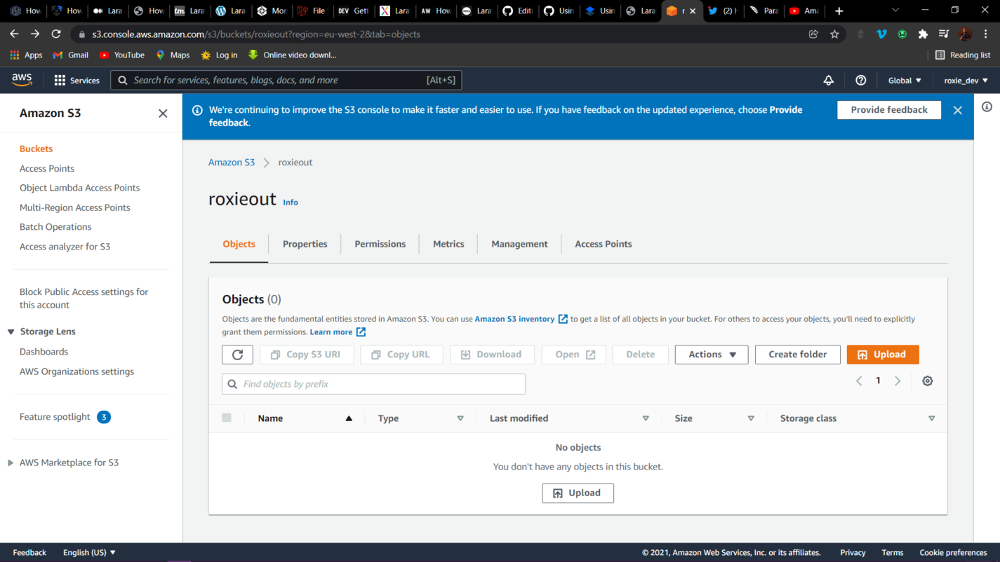
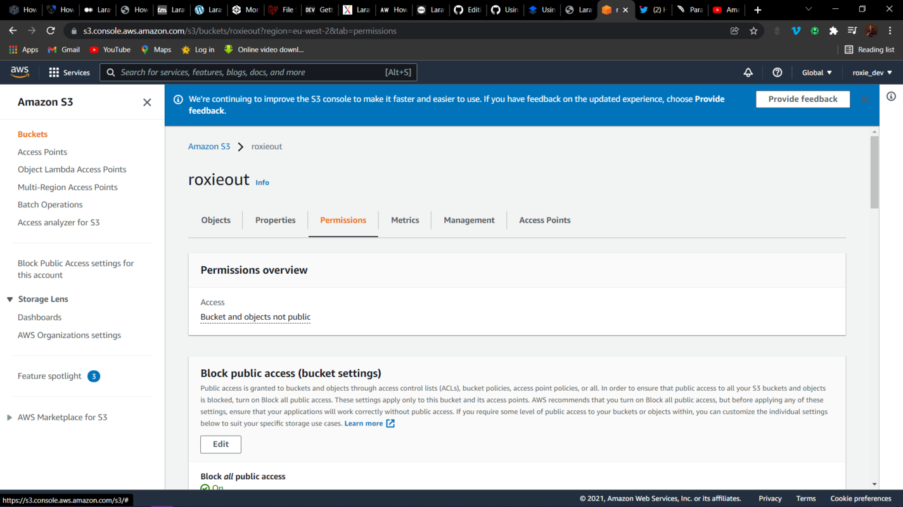
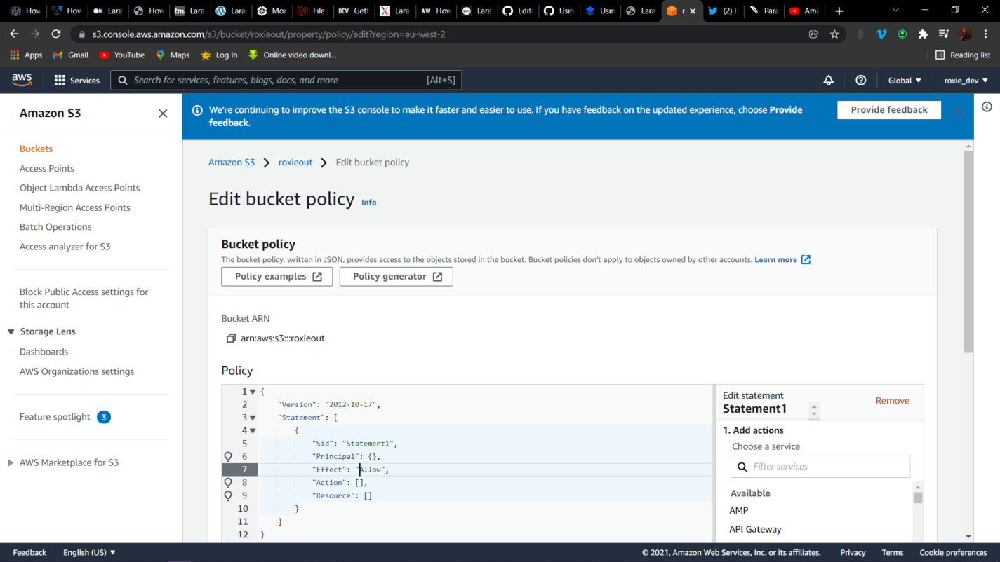
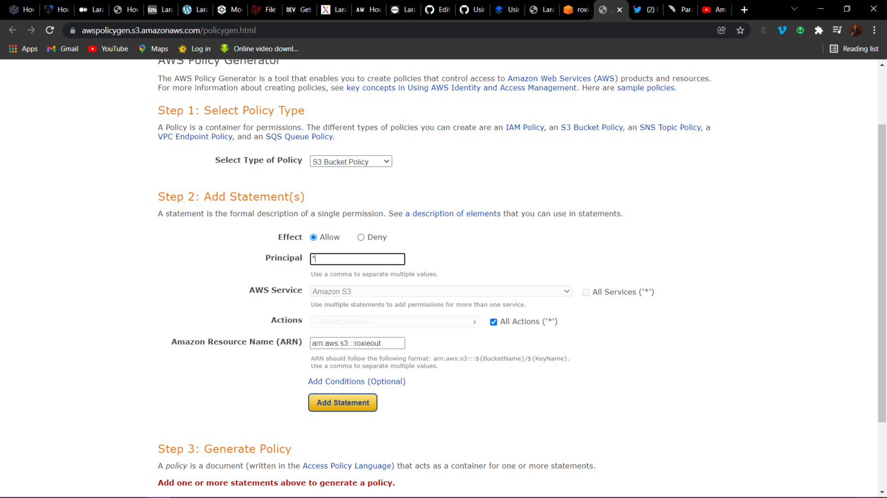
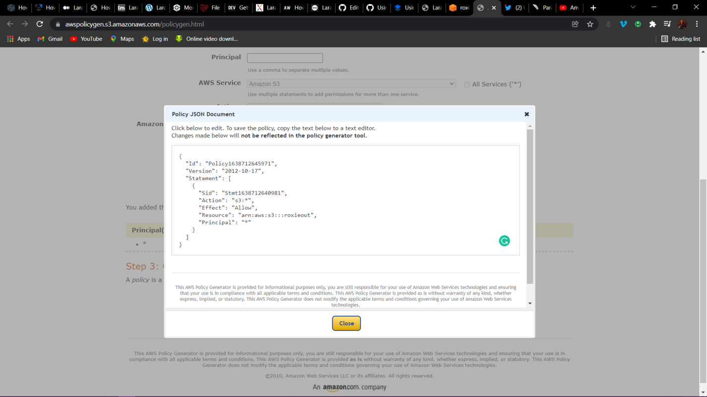
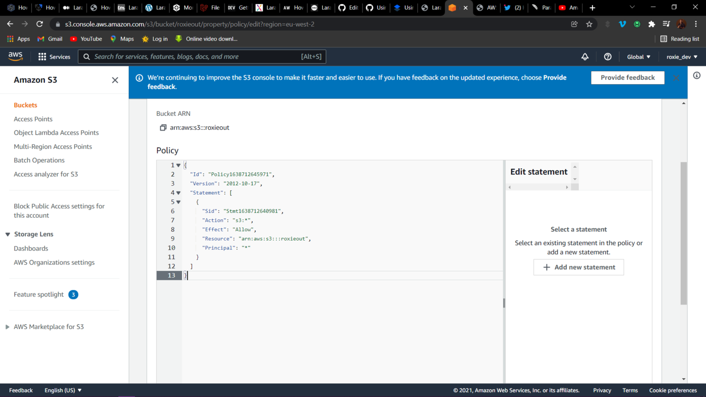
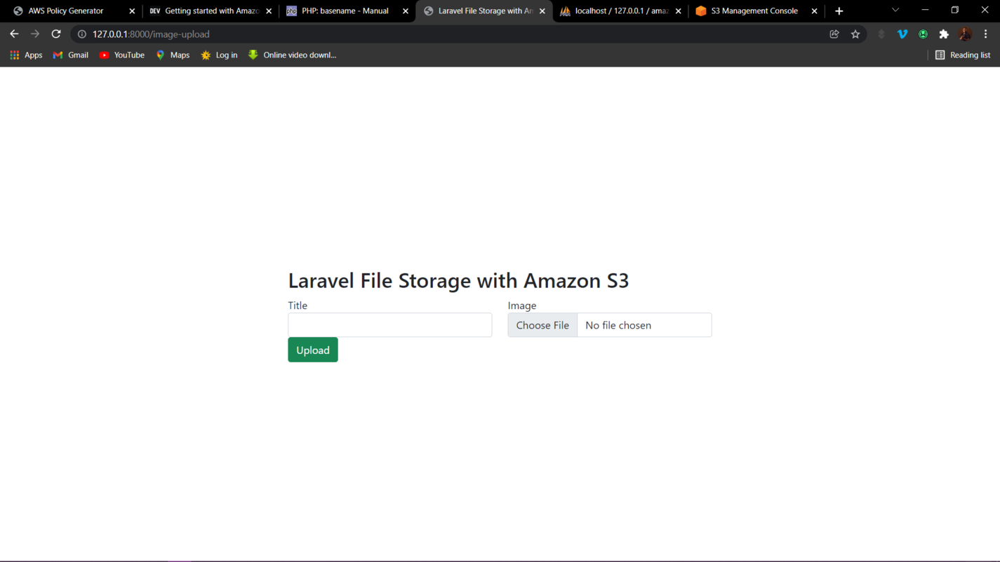
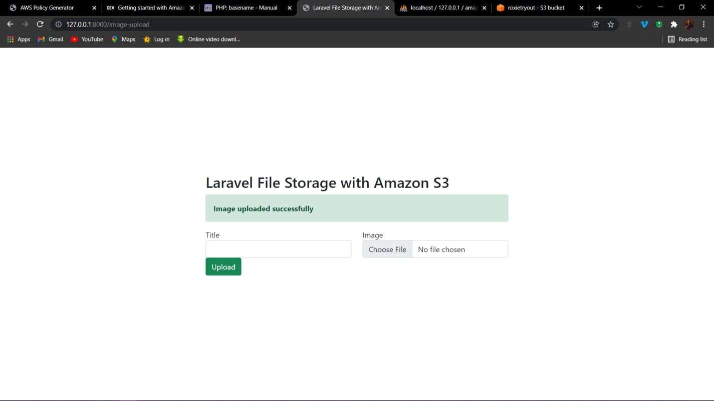
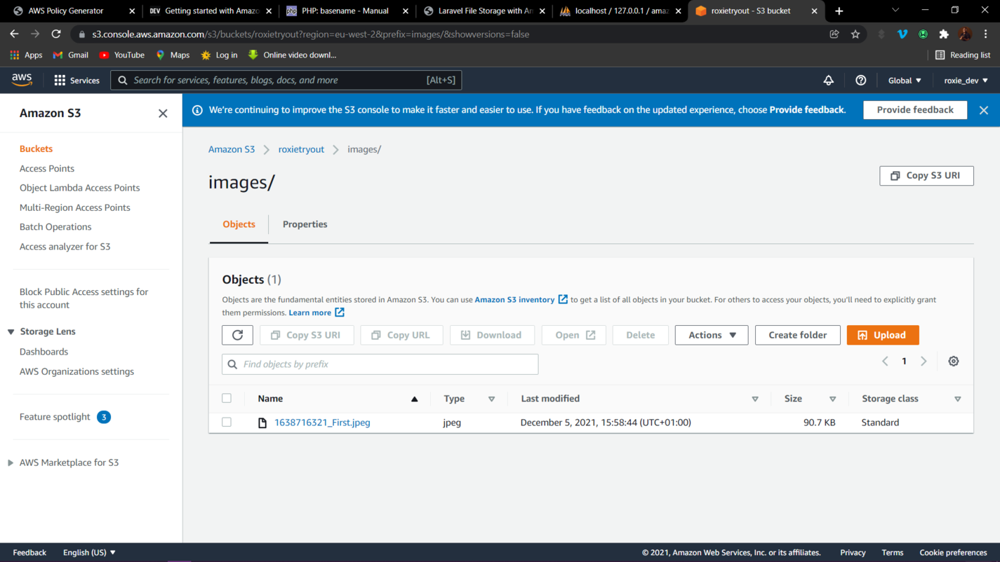

# Using S3 for File Storage in Laravel Apps

## Preface

Laravel incorporates a strong file system abstraction that provides simple drivers for working with local filesystems, SFTP, and Amazon S3. This article will explain how to use Amazon Simple Storage Service (S3) for file storage in Laravel. It also provides in-depth foundational knowledge of file systems, Amazon S3 storage, file storage in Laravel, and their relationships. Here are a few things you'll learn:

- File systems.
- What is Amazon S3?
- Setting up an Amazon S3 bucket.
- AWS Identity and Access Management (IAM) service.
- Configuring S3 cloud storage credentials.
- File storage with S3 in Laravel.

## Introduction

[Laravel Filesystem](https://laravel.com/docs/master/filesystem) provides different drivers to work with, for example, local filesystem, Amazon S3, and Rackspace. These drivers provide a convenient and easy way to upload files locally or on the cloud. For Amazon S3, although the functionality is essentially built into the framework, getting started can be a little disorienting, especially for people who aren't familiar with the AWS suite. To integrate it successfully, we only need our AWS credentials to access the console and create a new S3 bucket.

## File Systems

A file system is a mechanism and data structure for controlling how data is saved and accessed. There are numerous types of file systems. Each one has its own structure, logic, and characteristics, such as speed, adaptability, security, and size. Some file systems were created with specific applications in mind. The way files are named, saved, and retrieved from a storage device is defined by a file system. Without a file system, the storage device would have a large chunk of data placed back-to-back and wouldn't be distinguishable.

## Amazon Simple Storage Service (S3)

The Amazon Simple Storage Service (Amazon S3) is a web-based cloud storage service that is scalable, high-speed, and easy to use. On Amazon Web Services, the service is meant for data and application backup and archiving online (AWS). It's an AWS cloud service for storing data in a safe, highly accessible, and redundant manner. Customers of different sizes and sectors utilize it for a variety of purposes, including backup and recovery and data storage for cloud-native applications.

It is a cloud-based object storage service that provides industry-leading scalability, data availability, security, and performance. You can save money, organize data, and establish fine-tuned access restrictions to suit specific business, organizational, and compliance requirements with cost-effective storage classes and easy-to-use administration tools.

## Benefits of S3 Storage

### Versioning

Versioning allows different variants of a file/object to reside in the same bucket, but it is not enabled by default. If an object is accidentally removed, this allows for a rollback or recovery. S3 will also manage the removal of non-current versions of an object if an object expiration lifecycle policy is implemented.

### Security

Thanks to encryption features and access management capabilities, data stored in your AWS S3 environment are protected from unauthorized access. This includes restricting public access to all of your items, at both the bucket and the account level. The security of data stored regionally is ensured by strong authentication.

### Data Redundancy

AWS S3 maintains your data across numerous devices in an S3 region that spans at least three availability zones (AZs). It has reduced redundancy storage (RRS), which minimizes latency by storing data in buckets that are geographically separated. For users in geographically scattered locations, this saves resources and improves application efficiency.

### Accessibility, Scalability, and Durability

For things stored in S3, the service guarantees 99.999999999 percent durability and offers several security and compliance certifications. It allows for infinite data and object storage in a number of formats for most data types. A stored dataset, which is an object, ranges from 1 to 5 gigabytes.

### REST and SOAP API Interfaces

S3 storage provides web service interfaces based on representational state transfer (REST) and simple object access protocol (SOAP) that may be used with any form of Web development toolkit.

## AWS S3 Buckets

A bucket is a box that holds objects. A file and any metadata that describe it are also considered objects. To store an object in Amazon S3, you must first establish a bucket and then upload the object to it. You may open, download, and transfer the object once it's in the bucket. You can clean up your resources when you no longer require an object or a bucket.

### How to Create an S3 Bucket

- [Log in](https://signin.aws.amazon.com/) to your AWS account; if you don’t have one already, sign up for one.
- Proceed to the [S3 section.](https://s3.console.aws.amazon.com/s3/home)
- Select “Create Bucket”.
- Enter a unique name for your bucket.
- Select a region.
- Uncheck the box to block public access.
- Leave all other default settings unchanged and select “Create”.

### How to Create a Bucket Policy

This is an AWS Identity and Access Management (IAM) policy that is resource-based. To provide other AWS accounts or IAM users access permissions to the bucket and the items within it, you must apply a bucket policy. Object permissions only apply to items created by the bucket owner.

Begin by selecting the bucket.



Select the “Permissions” tab and then select “Edit“ in the “Bucket Policy“ session.



Copy Bucket ARN and proceed to the “Policy Generator“.



Edit the statement. Use the ARN you copied earlier.



Generate the policy document.



The Policy is generated in JSON format. Copy and paste it into the Bucket Policy tab and save. Ensure that you have unchecked "Block all public access" in the permissions tab before creating the bucket policy.



## AWS Identity and Access Management (IAM) Service

[AWS Identity and Access Management (IAM](https://aws.amazon.com/iam/)) allows for fine-grained access management throughout the whole AWS infrastructure. You can control who has access to which services and resources, and under what conditions, using IAM. You can manage permissions to your workforce and systems with IAM policies to ensure least-privilege permissions and easily manage authorized and unauthorized resources.
You can manage users and permissions in AWS with AWS Identity and Access Management (IAM). The service is geared towards businesses with a large number of users or systems that use AWS products. Users’ security credentials, such as access keys, and permissions can all be managed from a single location.

### How to Create an IAM User

If you don’t have an existing user, you can [create a new one](https://console.aws.amazon.com/iamv2/home?region=eu-west-2#/users) and add a bucket policy that allows the [IAM user to upload to an S3 bucket](https://console.aws.amazon.com/iamv2/home?region=eu-west-2#/users).

- Select “Add User”.
- Add the user name and select the AWS access type.
- Set the password and then proceed to permissions.
- Leave the other default settings unchanged and create the user.
- Save the user’s access key ID and secret access key since the secret access key can only be viewed once.

## File Storage with S3 in Laravel

Next, you’ll learn how to upload files to S3 in Laravel. It’s important to have created your bucket and IAM user before proceeding. You’ll need the user’s access key ID and secret access key.

Laravel now has a simple method for uploading files to Amazon S3. Because Laravel comes with the setup to use it whenever you want, the approach is really simple. We only need our AWS credentials to access the interface and build a new S3 bucket to integrate it effectively. Doesn’t this seem easy?

### Create a New Laravel Application

You can create a new Laravel project via the Composer command or the Laravel installer:

```bash
laravel new project_name   
or
composer create-project laravel/laravel project_name
```

### Add Amazon S3 Cloud Storage Credentials

Open the `.env` file and update the AWS bucket configurations.

```php
AWS_ACCESS_KEY_ID=
AWS_SECRET_ACCESS_KEY=
AWS_DEFAULT_REGION=<region_name>
AWS_BUCKET=<bucket_name>
AWS_USE_PATH_STYLE_ENDPOINT=false
```

In `conig/filesystems.php`, the S3 driver is configured in the `s3 array` and can be modified to suit your requirements.

```php
's3' => [
            'driver' => 's3',
            'key' => env('AWS_ACCESS_KEY_ID'),
            'secret' => env('AWS_SECRET_ACCESS_KEY'),
            'region' => env('AWS_DEFAULT_REGION'),
            'bucket' => env('AWS_BUCKET'),
            'url' => env('AWS_URL'),
            'endpoint' => env('AWS_ENDPOINT'),
            'use_path_style_endpoint' => env('AWS_USE_PATH_STYLE_ENDPOINT', false),
        ],
 ```

### Set Up the Model and Migrations

Now that we have made the necessary configuration changes, create the model and database migration simultaneously by running the following command:

```bash
php artisan make:model Image -m
```

This creates a [model](https://laravel.com/docs/8.x/eloquent) file called *Image.php* in the *app/Models* directory, and a [migration](https://laravel.com/docs/8.x/migrations#introduction) file called *create_images_table.php* in the *database/migrations* directory.
Update *Images.php* by adding the code below to the top of the file, which enables Model [mass assignment](https://laravel.com/docs/8.x/eloquent#mass-assignment).

```php
protected $guarded = [];
```

Then, update the `up()` method of the migration file as shown in the following example.

```php
 public function up()
    {
        Schema::create('images', function (Blueprint $table) {
            $table->id();
            $table->string('title');
            $table->string('image');
            $table->timestamps();
        });
    }
```

### Connect to Your Database

[Here](https://dev.to/roxie/how-to-connect-laravel-application-to-mysql-database-5han) is an article I wrote that explains how to [connect a Laravel Application to a MySQL database](https://dev.to/roxie/how-to-connect-laravel-application-to-mysql-database-5han). If you have a different database, make sure to connect to it appropriately.

### Install the Composer Package

Before using the S3 driver, you will need to install the appropriate package via the Composer package manager:

```bash
composer require --with-all-dependencies league/flysystem-aws-s3-v3 "^1.0"
```

### Set Up the Controller

To create the controller, run this Artisan command:

```php
php artisan make:controller ImageController
```

It will create a new file called *ImageController.php* in the *app/Http/Controllers* directory. After creating the file, add the following `import` statements to import the classes that the controller will use:

```php
use App\Models\Image;
use Illuminate\Http\Request;
```

Next, update the controller with an `upload()` method to return the form to upload and a `store()` method to upload the image to S3.

```php
public function upload()
    {
        return view('upload');
    }
    public function store(Request $request)
    {
        $request->validate([
            'title' => 'required',
            'image' => 'required|image|mimes:jpeg,png,jpg,gif,svg|max:2048',
        ]);
        if ($request->hasFile('image')) {
            $extension  = request()->file('image')->getClientOriginalExtension(); //This is to get the extension of the image file just uploaded
            $image_name = time() .'_' . $request->title . '.' . $extension;
            $path = $request->file('image')->storeAs(
                'images',
                $image_name,
                's3'
            );
            Image::create([
                'title'=>$request->title,
                'image'=>$path
            ]);
            return redirect()->back()->with([
                'message'=> "Image uploaded successfully",
            ]);
     }
    }
```

### Set Up Routes

You need one route for getting the view and another for storing the image.

To define them, add the following code to *routes/web.php*.

```php
Route::get('image-upload', [ ImageController::class, 'upload' ])->name('image.upload');
Route::post('image-store', [ ImageController::class, 'store' ])->name('image.upload.post');
```

Then, add the `import` statement to the top of the file.

```php
use App\Http\Controllers\ImageController;
```

### Set Up the View

You will need to create a blade file *resources/views* directory called *upload.blade.php.* and update it like this:

```php
<!DOCTYPE html>
<html>
<head>
    <title>Laravel File Storage with Amazon S3 </title>
    <link rel="stylesheet" href="https://cdn.jsdelivr.net/npm/bootstrap@5.1.3/dist/css/bootstrap.min.css">
</head>
    
<body>
<div class="container d-flex justify-content-center align-items-center" style="height: 100vh;">
     
    <div class="panel panel-primary">
      <div class="panel-heading"><h2>Laravel File Storage with Amazon S3 </h2></div>
      <div class="panel-body">
     
        @if (Session::get('message'))
        <div class="alert alert-success alert-block">
                <strong>{{Session::get('message')}}</strong>
        </div>
        @endif
    
        @if (count($errors) > 0)
            <div class="alert alert-danger">
                <strong>Whoops!</strong> There were some problems with your input.
                <ul>
                    @foreach ($errors->all() as $error)
                        <li>{{ $error }}</li>
                    @endforeach
                </ul>
            </div>
        @endif
    
        <form action="{{ route('image.upload.post') }}" method="POST" enctype="multipart/form-data">
            @csrf
            <div class="row">
                <div class="col-md-6">
                    <label for="">Title</label>
                    <input type="text" name="title" class="form-control">
                </div>
    
                <div class="col-md-6">
                    <label for="">Image</label>
                    <input type="file" name="image" class="form-control">
                </div>
     
                <div class="col-md-6">
                    <button type="submit" class="btn btn-success">Upload</button>
                </div>
     
            </div>
        </form>
    
      </div>
    </div>
</div>
</body>
  
</html>
```

### Testing

You can now test to see if the image uploads correctly. Visit the form at `http://127.0.0.1:8000/image-upload`. It should look like this:



After uploading the image, it gives a successful alert. You can also check the bucket to see if the image uploaded successfully.





## Conclusion

In this tutorial, you’ve learned how to handle file storage with S3 in Laravel. File storage in Laravel is a broad concept on its own, but this tutorial can serve as a great starter guide. More information can be found in the [official Laravel documentation](https://laravel.com/docs/8.x/filesystem). The code for this project is open-source and available [on GitHub](https://github.com/Roxie-32/amazon_s3).

I am open to questions, contributions, and conversations on better ways to implement APIs, so please comment on the repository or DM me [@twitter](https://twitter.com/OlasupoFunke).

**Happy coding!**
